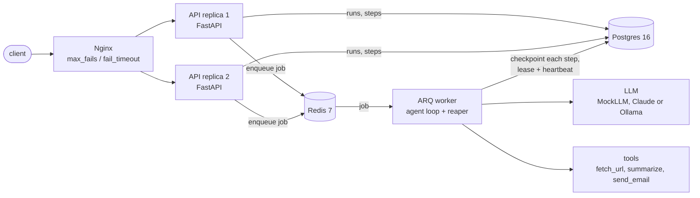
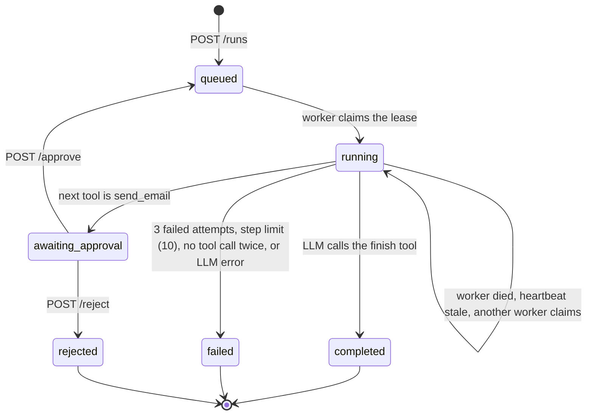

# resilient-agent-runner

A backend service that runs multi-step AI agent tasks and keeps them correct when things break.
Every step is checkpointed in Postgres, so a run survives a worker crash, retries failed tools safely,
waits for human approval before side effects, and never sends the same email twice.
The API runs as two replicas behind Nginx and keeps answering when one goes down.

The agent itself is deliberately simple. The interesting part is what happens when it fails.

## Architecture



Postgres is the source of truth. Redis only carries "go look at run X" messages, so a lost or
duplicated job can't lose or duplicate work.

## Run it

Needs Docker with compose.

```bash
docker compose up -d --build        # API on http://localhost:8080
docker compose run --rm tests       # test suite (real Postgres and Redis)
./scripts/demo.sh                   # crash recovery + failover demo (needs internet)
```

```bash
curl -X POST localhost:8080/runs -H 'content-type: application/json' \
  -d '{"task": "Summarize https://example.com and email it", "idempotency_key": "abc-1"}'
curl localhost:8080/runs/<id>
curl -X POST localhost:8080/runs/<id>/approve     # or /reject
curl localhost:8080/health
```

The default LLM is `MockLLM`, a fixed script (fetch_url → summarize → send_email → finish) that needs
no API key. A run ends only when the model calls the `finish` tool; its `result` argument is stored on
the run and returned by `GET /runs/{id}`. To use Claude, put `LLM_PROVIDER=claude` and `ANTHROPIC_API_KEY=...` in `.env`
(see `.env.example`).

## Running with a local model

Ollama runs as a compose service under the `local-llm` profile, so nothing is installed on the host.
The model (about 2 GB) is downloaded once into a named volume.

```bash
docker compose --profile local-llm up -d
docker compose exec ollama ollama pull qwen2.5:3b
LLM_PROVIDER=ollama docker compose up -d worker
```

The last command recreates the worker with the new setting (`docker compose restart` would keep the
old environment). Putting `LLM_PROVIDER=ollama` in `.env` works too. `OPENAI_BASE_URL`, `OPENAI_MODEL`
and `OPENAI_API_KEY` point the same provider at any other OpenAI-compatible endpoint, such as vLLM.

## Run state machine



## How recovery works

- **Checkpointing.** The LLM's decision is written to `run_steps` as `pending` and committed before the
  tool runs. On resume the worker executes a `pending` step as recorded and never asks the LLM for it
  again. A `completed` step is never executed again.
- **Lease.** A worker takes a run with one atomic `UPDATE ... WHERE status = 'queued' OR (status = 'running'
  AND heartbeat_at < now() - 60s)`. Two workers racing for the same run serialize on the row lock and
  only one gets a row back. The owner heartbeats every 10 s.
- **Fencing.** Every write a worker makes starts with `SELECT ... WHERE lease_owner = me FOR UPDATE`.
  A worker that stalled and lost its lease finds no row and stops without writing.
- **Reaper.** On worker startup and every 30 s it selects stale runs (`FOR UPDATE SKIP LOCKED`) and
  re-enqueues them. It only enqueues; the claim decides who runs. It also picks up `queued` runs whose
  job never reached Redis.
- **Idempotent side effects.** `send_email` writes to `outbox` with a unique `(run_id, step_no)`, in the
  same transaction that marks the step completed. A retry or resume cannot produce a second row.

A step that was in flight when the worker died is executed again (at-least-once). `fetch_url` and
`summarize` are read-only, and `send_email` is covered by the unique key.

## Failure scenarios tested

| Scenario | What happens | How it's tested |
|---|---|---|
| Same `idempotency_key` sent twice, or 5 times concurrently | One run is created; the others get the existing run | `test_api.py`: `test_same_idempotency_key_returns_same_run`, `test_concurrent_posts_with_same_key_create_one_run` |
| Tool fails twice, then works | Retried with exponential backoff; run completes with `attempts = 3` | `test_agent.py::test_tool_fails_twice_then_succeeds` |
| Tool fails every time | After 3 attempts the step and run are `failed`, error saved, later steps never run | `test_agent.py::test_tool_fails_permanently` |
| Tool call hangs | Cancelled at the timeout (30 s) and treated as a failed attempt | `test_agent.py::test_tool_call_times_out` |
| Model claims completion without calling a tool ("Sent the email." as plain text) | Only a `finish` tool call completes a run. A plain-text reply gets one corrective message; a second one fails the run with `model replied without a tool call: <text>`. The correction is not a step and is not checkpointed | `test_finish.py`: `test_text_reply_once_is_corrected_and_the_run_recovers`, `test_text_reply_twice_fails_the_run_with_the_text_saved`, `test_resume_after_crash_with_text_replies_and_finish` |
| LLM never calls `finish` | Run is `failed` after 10 steps | `test_agent.py::test_looping_llm_stops_at_step_limit` |
| Worker dies after step 2 | Run stays `running` until the heartbeat is stale, then resumes at step 3; steps 1 and 2 are each called once | `test_recovery.py::test_resume_after_crash_does_not_rerun_completed_steps`, and `scripts/demo.sh` with a real `SIGKILL` |
| 8 workers try to claim the same run | Exactly one wins | `test_recovery.py::test_only_one_worker_can_claim_a_run` |
| Worker stalls, another takes over, the first wakes up | The first worker's write is refused; no step output, no email | `test_recovery.py::test_worker_that_lost_its_lease_cannot_write` |
| Job lost between Postgres commit and Redis | Reaper re-enqueues the `queued` run | `test_recovery.py::test_reaper_selects_only_stale_runs` |
| LLM asks `fetch_url` for an internal address (`http://api1:8000`, `127.0.0.1`, `169.254.169.254`, `10.0.0.5`, `file://`), directly or through a redirect | Refused before any connection is made; the step fails on the first attempt with `blocked: private address` and is not retried | `test_fetch_url.py` |
| `send_email` reached | Run stops at `awaiting_approval`; nothing is sent until approved; approve then sends exactly one | `test_approval.py::test_run_pauses_for_approval_then_approve_sends_exactly_one_email` |
| Approval rejected | Run is `rejected`, outbox empty | `test_approval.py::test_reject_ends_run_without_sending` |
| Approve and reject at the same time | One returns 200, the other 409 | `test_approval.py::test_concurrent_approve_and_reject_only_one_wins` |
| One API replica stopped | Nginx retries the request on the other replica, then stops routing to the dead one | `scripts/demo.sh` step 6 (20 of 20 requests return 200) |

## Known limits

- Only the API tier is redundant. Postgres and Redis are single instances here.
- Nginx health checking is passive (`max_fails=2 fail_timeout=10s`): it reacts to failed requests and
  retries them on the other replica. It does not poll `/health`; active checks need Nginx Plus or an
  external checker.
- `fetch_url` only fetches public addresses: it resolves the host, refuses loopback, private and
  link-local addresses, connects to the address it checked, and re-checks every redirect (max 3).
  A real deployment would still put an egress proxy in front of it.
- The Claude implementation is unit-tested against a fake client only. It has not been run against the
  live API.

## What I'd add for production

- **Patroni** for Postgres HA (leader election, automatic failover), with the API and worker connecting
  through HAProxy or a VIP.
- **pgBackRest** backups with WAL archiving, plus scheduled restore drills: a backup that has never been
  restored is not a backup.
- **Keycloak** (OIDC) in front of the API, with a separate role for who may approve a run.
- **Prometheus metrics**: runs by status, step retries, reaper recoveries, heartbeat age, queue depth,
  and alerts on runs stuck in `running` or `awaiting_approval`.
